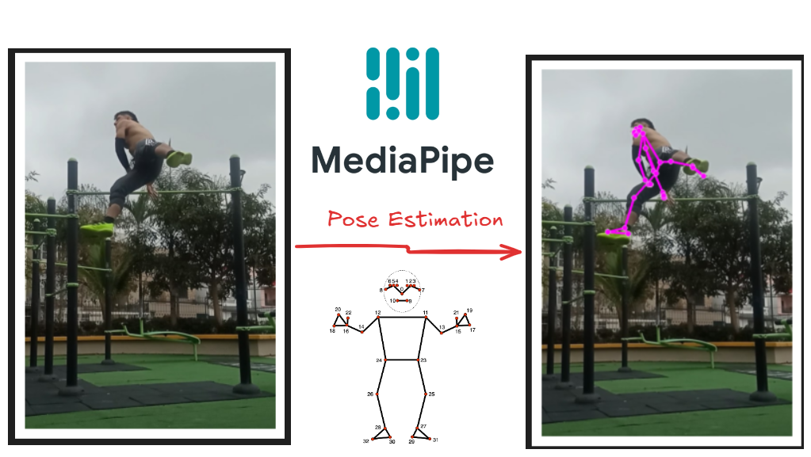
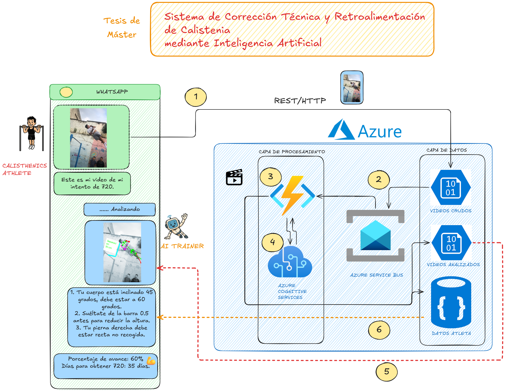
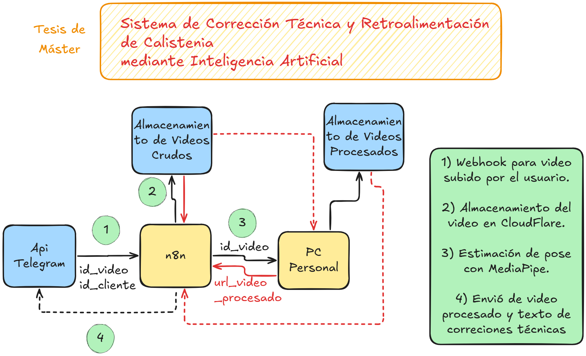
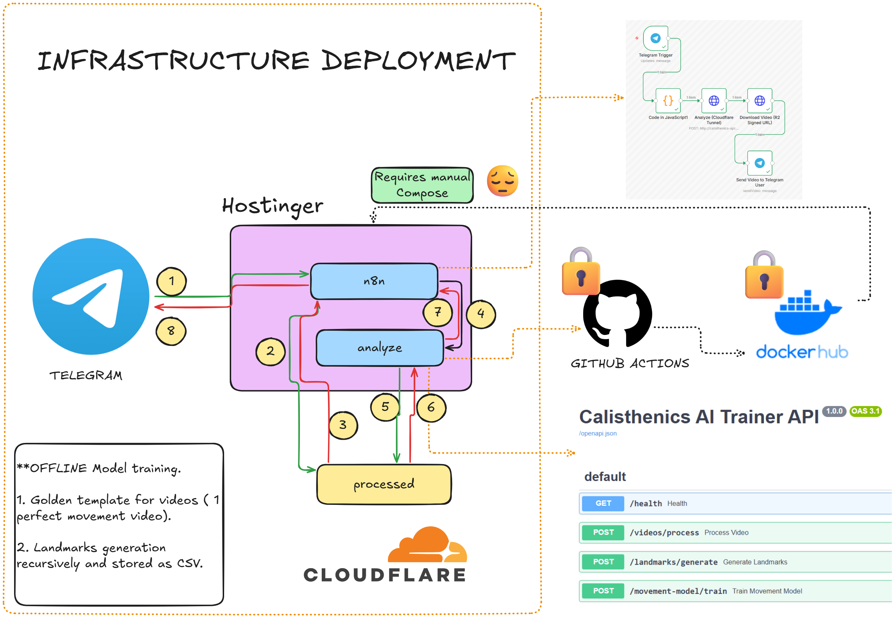
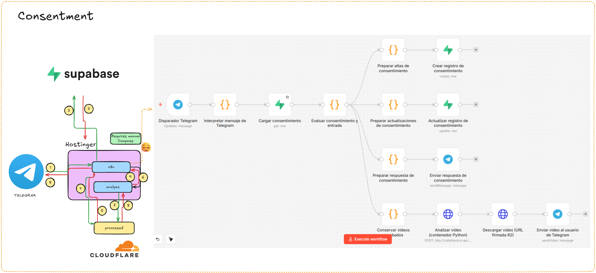

# Calisthenics AI Trainer (Tesis de Maestría)

Este repositorio contiene la implementación actual y el avance del dataset para nuestro proyecto de tesis de maestría sobre análisis de movimientos de calistenia con MediaPipe.

Autores: **José Guambo** y **Aaron Echeverría**

## Repositorios

- Repositorio de código fuente: [GitHub - calisthenics-ai-trainer-mediapipe-lite](https://github.com/joseguambo1994/calisthenics-ai-trainer-mediapipe-lite)
- Repositorio de imágenes: [Docker Hub - joseguambo1994/calisthenics-api](https://hub.docker.com/repository/docker/joseguambo1994/calisthenics-api/settings)

## Ejecución del Flujo


## Arquitectura

### Versión 1



### Versión 2



### Versión 3



### Versión 4



### Versión 5



## Bitácora de Decisiones Arquitectónicas

### Versión 1: prueba local de factibilidad

En la primera versión trabajamos de forma completamente local. El objetivo era validar rápidamente si MediaPipe, la primera librería que encontramos para estimación de pose, podía detectar de manera confiable los landmarks o articulaciones del cuerpo humano en videos de calistenia.

Esta etapa fue una prueba de factibilidad. Antes de diseñar una arquitectura distribuida, necesitábamos confirmar que la base técnica del proyecto era viable y que la detección de pose funcionaba para nuestros movimientos objetivo.

### Versión 2: diseño inicial con WhatsApp y Azure

En la segunda versión diseñamos un flujo cuyo punto de entrada era WhatsApp. La mayor parte de los servicios estaba pensada para ejecutarse en Azure:

- Azure Blob Storage para almacenar videos sin procesar y videos procesados.
- Azure Functions para ejecutar la lógica de procesamiento.
- Azure Cognitive Services como base para la etapa de pose estimation.
- Azure Service Bus para orquestar el envío de la respuesta final.

La idea era que el video ingresara por WhatsApp, se almacenara en Blob Storage, se activara el procesamiento mediante triggers y, al finalizar, se enviara una respuesta al usuario con el video analizado y correcciones técnicas en texto. Esta propuesta aprovechaba especialmente la integración por eventos de Blob Storage.

### Versión 3: cambio de canal, simplificación operativa y reducción de costos

En la tercera versión hicimos varios ajustes importantes. El principal cambio fue abandonar WhatsApp Business como canal principal. Aunque logramos probar el envío de mensajes con la API de Meta, la configuración completa resultó demasiado compleja para nuestro contexto y la integración no nos permitió avanzar de forma fluida con videos.

Además, para pasar a un entorno productivo con WhatsApp Business era necesario presentar evidencia legal de la empresa y esperar procesos de revisión burocráticos. Eso bloqueaba el avance del proyecto.

Por esa razón migramos a Telegram. La configuración fue casi inmediata usando BotFather, donde definimos el nombre del bot, una descripción básica y obtuvimos una API key para pruebas del webhook. En ese punto, enviamos un video a `@CalistenIA_Entrenador_Bot` y el flujo funcionó correctamente desde el inicio.

También alquilamos un despliegue de n8n en Hostinger, con un costo aproximado de 16 dólares mensuales, y movimos allí la automatización principal. En esta etapa, todo el flujo vivía en la nube, excepto el analizador de video, que seguía ejecutándose en un computador personal. Además, reemplazamos Azure Blob Storage por Cloudflare para almacenar videos, principalmente por su free tier generoso y su salida de datos sin costo adicional.

### Versión 4: contenedorización completa y despliegue conjunto en VPS

La cuarta versión fue la consolidación operativa del sistema. Contenerizamos el analizador de video en Python y lo desplegamos en el mismo VPS de Hostinger donde ya estaba corriendo n8n, usando Docker Compose. El servidor utilizado corresponde al plan KVM 4, con 4 vCPU, 16 GB de memoria y 200 GB de espacio en disco.

Este cambio respondió a un problema de rendimiento muy claro. El flujo completo tardaba alrededor de 45 segundos y, al revisar los tiempos de transacción en n8n, vimos que más del 90% del tiempo estaba asociado al procesamiento remoto del video en la máquina local. Ese retraso provenía de tres factores:

- La transferencia del video por internet entre el VPS y la máquina local.
- El procesamiento en un equipo no dedicado, con otras tareas ejecutándose en background (Sistema Operativo Windows).
- La latencia al devolver el resultado otra vez al servidor.

Además, la máquina local debía permanecer encendida permanentemente y sufría fallos de red frecuentes debido a una conexión inestable. Al mover el analizador al mismo VPS, ambos servicios pudieron comunicarse por red interna. Como resultado, el tiempo total bajó aproximadamente a 7 segundos.

En esta versión también incorporamos optimizaciones de despliegue. Creamos un repositorio privado en GitHub y lo integramos con GitHub Actions para construir y publicar automáticamente una imagen en Docker Hub cuando hay cambios en el código. El proceso todavía no es completamente automático porque, después de publicar la imagen, aún debemos entrar al VPS y volver a ejecutar `docker compose` para que se haga un pull de la nueva imagen del contenedor de python para procesamiento de video.

Finalmente, definimos endpoints específicos para separar responsabilidades:

- `video/process`: endpoint llamado por n8n para analizar videos.
- `landmarks/generate`: endpoint interno para generar archivos CSV a partir de videos de ejemplo de ejecución perfecta del movimiento.
- `movement-model/train`: endpoint que toma los CSV y entrena el clasificador de movimientos, cuyo artefacto se almacena en `models/movement_template_model.npz`.

El archivo `pose_landmarker_lite.task` es el modelo base proporcionado por Google que usamos para la pose estimation. El modelo que utilizamos para clasificar los movimientos se encuentra en `models/movement_template_model.npz`.

### Versión 5: gestión de consentimiento con Supabase y n8n

En la quinta versión agregamos un paso previo de consentimiento antes de ejecutar cualquier acción sobre el video enviado por el usuario. Este cambio se incorporó en el flujo de n8n porque Telegram no ofrece, de forma nativa, un mecanismo automático para configurar y gestionar mensajes de consentimiento explícito para nuestro caso de uso.

La solución implementada utiliza Supabase como almacenamiento del estado de consentimiento. Antes de procesar un video, enviamos a Supabase el `telegram_user_id`, que nos permite identificar al usuario sin necesidad de conocer ni almacenar su número telefónico real.

A partir de ese identificador, n8n envía un mensaje en Telegram solicitando autorización explícita para el uso y tratamiento de los datos. Esta lógica fue construida principalmente con nodos JavaScript dentro de n8n, que evalúan el estado actual del consentimiento y determinan la acción a seguir.

Si el usuario no acepta, registramos en Supabase su `telegram_user_id`, el estado `declined` y la fecha correspondiente. En ese caso, el sistema no vuelve a solicitar el consentimiento en interacciones posteriores.

Si el usuario acepta, registramos en Supabase su `telegram_user_id`, el estado `accepted` y la fecha de aceptación. A partir de ese momento, el flujo puede continuar con el procesamiento del video y el envío de la respuesta técnica.

## Estructura de Carpetas

La carpeta `movements` sigue esta organización general. Cada movimiento contiene las vistas `back`, `diagonal` y `side`. Dentro de cada vista pueden existir archivos como `video.mp4`, `landmarks.csv` y `landmarks.json`, según el avance de procesamiento de ese ejemplo.

```text
movements/
├── mapping.md
├── double-swing-360/
│   ├── back/
│   │   ├── video.mp4
│   │   ├── landmarks.csv
│   │   └── landmarks.json
│   ├── diagonal/
│   │   ├── video.mp4
│   │   ├── landmarks.csv
│   │   └── landmarks.json
│   └── side/
│       ├── video.mp4
│       ├── landmarks.csv
│       └── landmarks.json
├── dragon-360/
├── geinger/
├── handstand/
├── olympic-muscle-up/
├── pasavallas/
├── strict-muscle-up/
├── swing-360/
└── torero/
```

## Avance del Dataset (Movimiento x Ángulo)

Leyenda de estado:
- `✅`: existe al menos un archivo `.mp4` en esa carpeta de movimiento/ángulo.
- `❌`: aún no está completado.

| Movimiento | Espalda | Diagonal | Lado |
|---|---|---|---|
| double-swing-360 | ❌ | ❌ | ❌ |
| dragon-360 | ❌ | ✅ | ✅ |
| geinger | ✅ | ✅ | ✅ |
| handstand | ❌ | ✅ | ✅ |
| olympic-muscle-up | ✅ | ✅ | ✅ |
| pasavallas | ❌ | ❌ | ❌ |
| strict-muscle-up | ✅ | ✅ | ✅ |
| swing-360 | ✅ | ✅ | ✅ |
| torero | ❌ | ✅ | ❌ |

## Avance del Dataset de Evaluación (Movimiento x Ángulo)

Leyenda de estado:
- `✅`: existe al menos un archivo `.mp4` en esa carpeta de movimiento/ángulo.
- `❌`: aún no está completado.

| Movimiento | Espalda | Diagonal | Lado |
|---|---|---|---|
| double-swing-360 | ❌ | ✅ | ❌ |
| dragon-360 | ❌ | ❌ | ✅ |
| geinger | ❌ | ✅ | ❌ |
| handstand | ❌ | ❌ | ❌ |
| olympic-muscle-up | ❌ | ✅ | ❌ |
| pasavallas | ❌ | ❌ | ❌ |
| strict-muscle-up | ❌ | ❌ | ❌ |
| swing-360 | ❌ | ✅ | ❌ |
| torero | ✅ | ✅ | ❌ |

## Comparación Final de Evaluación (Movimiento x Ángulo)

Leyenda de estado:
- `✅`: tanto `movements` como `movements-evaluation` contienen al menos un `.mp4` para ese movimiento/ángulo.
- `❌`: aún no está disponible en ambos datasets.

| Movimiento | Espalda | Diagonal | Lado |
|---|---|---|---|
| double-swing-360 | ❌ | ❌ | ❌ |
| dragon-360 | ❌ | ❌ | ✅ |
| geinger | ❌ | ✅ | ❌ |
| handstand | ❌ | ❌ | ❌ |
| olympic-muscle-up | ❌ | ✅ | ❌ |
| pasavallas | ❌ | ❌ | ❌ |
| strict-muscle-up | ❌ | ❌ | ❌ |
| swing-360 | ❌ | ✅ | ❌ |
| torero | ❌ | ✅ | ❌ |

## Historial de Commits

```text
009da35 | joseguambo1994 | 2026-04-12 | feat: Add dataset folder structure example.
7452cf0 | joseguambo1994 | 2026-04-12 | fix: Wrong model name in documentation.
bee0aad | joseguambo1994 | 2026-04-12 | feat: Add architectural decisions explanation.
9e9369a | joseguambo1994 | 2026-04-12 | chore: Change node text from eng to spanish.
a337442 | joseguambo1994 | 2026-04-05 | feat: Add consent step.
f2c17a5 | joseguambo1994 | 2026-04-05 | feat: Add n8n flow to consume local python container instead of cloudflare.
6c74eef | joseguambo1994 | 2026-03-01 | feat: Add model evaluation endpoint.
5e6a5b2 | joseguambo1994 | 2026-03-01 | fix: Wrong video name excluding dragon diagonal video from training.
98fa642 | joseguambo1994 | 2026-03-01 | feat: Add models evaluation landmarks files for dragon, geinger, olympic, swing, torero.
5a737f3 | joseguambo1994 | 2026-03-01 | fix: Video present in evaluation and not in training dataset for double swing 360.
edf6fe7 | joseguambo1994 | 2026-03-01 | feat: Add movements evaluation video dragon, torero, swing, double swing, geinger and olympic muscle up.
6476009 | joseguambo1994 | 2026-03-01 | feat: Update dataset and evaluation dataset advancement.
36480d7 | joseguambo1994 | 2026-02-17 | chore: Replace check and missing with icons..
9022ec6 | joseguambo1994 | 2026-02-17 | chore: Add readme. Add dataset completion matrix.
a450d27 | joseguambo1994 | 2026-02-17 | feat: Update model to detect dragon, geinger, handstand from back, side and diagonal..
24cc70a | joseguambo1994 | 2026-02-17 | feat: Add landmarks for new movements.
46e1734 | joseguambo1994 | 2026-02-17 | fix: remove root video from repository
117f6d1 | joseguambo1994 | 2026-02-17 | fix: Track videos used for training.
3095d51 | joseguambo1994 | 2026-02-17 | feat: Add movement name instead of deviation. Change font size and color inside video annotations.
c3a3826 | joseguambo1994 | 2026-02-17 | fix: Remove unused folder making template and current comparison not being drawn.
146c04a | joseguambo1994 | 2026-02-16 | feat: Add landmark baseline evaluator.
588838a | joseguambo1994 | 2026-02-16 | feat: Add models generation.
b3781eb | joseguambo1994 | 2026-02-16 | feat: Add support for camera angle in the local landmarks generation.
75bb137 | joseguambo1994 | 2026-02-16 | feat: Refactor to follow clean architecture for landmarks generation endpoint.
5d1eb32 | joseguambo1994 | 2026-02-16 | feat: Add landmarks generation.
a7fd7a5 | joseguambo1994 | 2026-02-14 | Merge branch 'main' of https://github.com/joseguambo1994/calisthenics-ai-trainer-mediapipe-lite
6a94e1a | joseguambo1994 | 2026-02-14 | feat: Add similarity percentage function.
cd7d044 | joseguambo1994 | 2026-02-14 | feat: Add baseline movements.
7f73c3b | joseguambo1994 | 2026-02-12 | chore: Remove unused notebook.
ea75ed6 | joseguambo1994 | 2026-02-12 | feat: Add dockerhub workflow.
8b87932 | joseguambo1994 | 2026-02-12 | feat: Add movement name. Add technique correction.
ce5e562 | joseguambo1994 | 2026-02-12 | feat: Add n8n flow to repository.
39f7335 | joseguambo1994 | 2026-02-12 | feat: Add technique feedback. Add movement name detection.
6e56c4f | joseguambo1994 | 2026-02-11 | feat: Add working dockerfile.
fee5ad1 | joseguambo1994 | 2026-02-11 | fix: Remove videos stored in server.
e10dc85 | joseguambo1994 | 2026-02-11 | feat: Remove unused fields in response.
c02b412 | joseguambo1994 | 2026-02-11 | feat: Add video signed url.
15b6653 | joseguambo1994 | 2026-02-11 | feat: Add Clean architecture. Add api to receive file_id and download from telegram.
6964573 | joseguambo1994 | 2026-02-11 | feat: Fix python code. Add cache ignore.
839dfac | joseguambo1994 | 2026-02-11 | feat: Add initial template.
```
